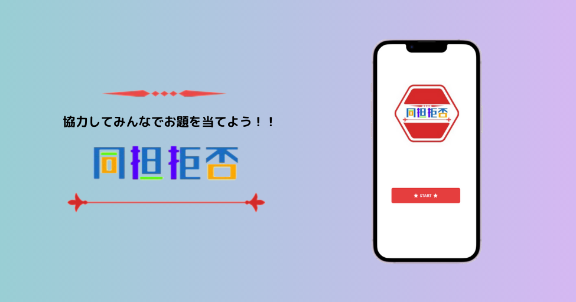

## 同担拒否

同担拒否は、みんなでヒントを出し合いお題を当てることを目指す協力ゲームです！

<!-- TODO: ルールを書く -->

## 🔗 サービス URL

https://doutankyohi.vercel.app/

## 🎮 遊び方

遊び方はこちら -> [遊び方](docs/rule.md)

## 🧑 開発体制

| メンバー                                 | 役割                       |
| ---------------------------------------- | -------------------------- |
| [@ltoppyl](https://github.com/ltoppyl)   | マネジメント, ロジック実装 |
| [@KEiJey](https://github.com/KEiJey)     | UI・ロジック実装           |
| [@zomatype](https://github.com/zomatype) | デザイン 作成              |

## ⚒️ 使用技術

  
  
  
  
  

